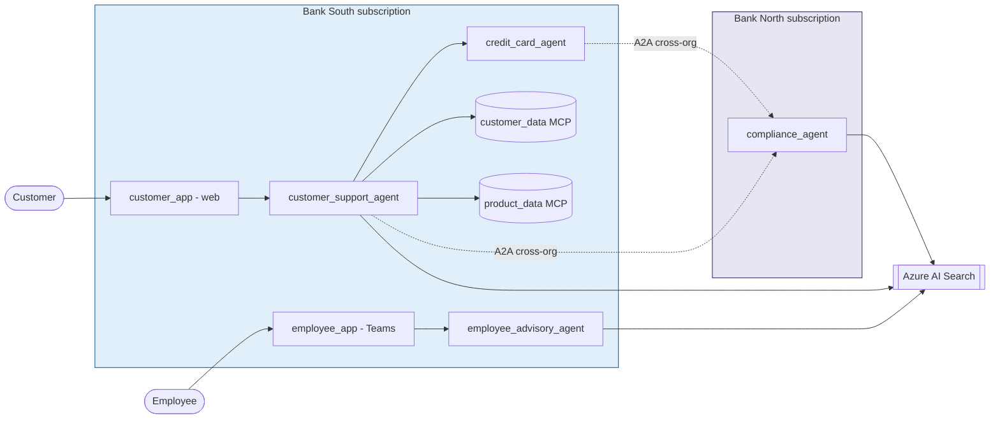

# 🏦 Agentic Banking Ecosystem

> A multi-organisation **agentic banking demo**: two independent banks — **Bank North**
> and **Bank South** — each run their own Microsoft Foundry agents, MCP servers and data
> in their own Azure subscription, and collaborate across organisational boundaries over
> **A2A**. Every hop is authenticated with **Microsoft Entra ID** and emits
> **OpenTelemetry** to Application Insights.


The two **cross-organisation** edges are the heart of the story: Bank South's agents
consume Bank North's **compliance agent** as an A2A service across subscription and tenant
boundaries.

## Contents

- [Architecture at a glance](#architecture-at-a-glance)
- [Repository layout](#repository-layout)
- [Prerequisites](#prerequisites)
- [Quickstart](#quickstart)
- [Components](#components) — [Agents](#agents) · [MCP servers](#mcp-servers) · [Container apps & search indexes](#container-apps--search-indexes)
- [Deployment (full walkthrough)](#documentation)
- [Cleaning up](#cleaning-up)

## Architecture at a glance



→ Full architecture — **component**, **data-flow** and **application-flow** views plus the
communication-paths table — lives in **[narrative.md](narrative.md#architecture)**.

## Repository layout

| Path | Contents |
|------|----------|
| `src/` | Agents (`*_agent`, each with a `skills/` folder) and MCP servers (`*_mcp_server`) |
| `scripts/` | azd hooks + deploy / build / index / cleanup scripts — run as `python -m scripts.<name>` from the repo root |
| `data/` | Canonical data model (`products.md`), seeded demo data (`customers.json`, `transactions.json`) and grounding docs (`knowledge/*.md`) |
| `infra/` | Bicep: Microsoft Foundry project, Azure AI Search, Container Apps environment, ACR, managed identity |
| `narrative.md` | The story + the full architecture (four Mermaid views) |
| `.github/skills/ops/SKILL.md` | End-to-end operations runbook (provision → deploy → clean up) |

## Prerequisites

| Tool | Version | Install |
|------|---------|---------|
| Azure Developer CLI (`azd`) | latest | https://aka.ms/azd |
| Azure CLI (`az`) | ≥ 2.60 | https://aka.ms/azcli |
| Python | 3.13+ | https://python.org |

```bash
# install all service + script dependencies
pip install -r requirements.txt
pip install -r scripts/requirements-agents.txt
```

You also need an Azure subscription with permission to create resources and Entra app
registrations, and `az login` completed.

## Quickstart

Provision the infrastructure, then deploy the servers, indexes and agents **in order**.
Each step links to its detailed section below.

```bash
azd env set AZURE_LOCATION swedencentral
azd env set AZURE_PRINCIPAL_ID $(az ad signed-in-user show --query id -o tsv)
azd env set AZURE_PRINCIPAL_TYPE User
azd up
```

Then run the deployment steps in this order (all from the repo root):

1. **Generate demo data** — `python -m scripts.generate_data`
2. **Build the MCP images** — [see below](#building-the-mcp-server-containers)
3. **Deploy the MCP servers** (+ register toolboxes) — [see below](#deploying-the-mcp-servers)
4. **Create & ingest the search indexes** — [see below](#creating-and-populating-the-search-indexes)
5. **Register the Foundry toolboxes** (incl. WorkIQ) — [see below](#registering-the-foundry-toolboxes)
6. **Deploy the agents** — [see below](#deploying-agents)
7. **Grant Agent 365 observability permissions** — [see below](#granting-agent-365-observability-permissions)

> New here? Start with the [full deployment walkthrough](#documentation), or use the
> [ops runbook skill](.github/skills/ops/SKILL.md) for the complete lifecycle.

## Components

The ecosystem models two banks — **Bank North** and **Bank South** — that each run
their own agents, MCP servers and data, while sharing some agents across
organisations. Every MCP tool call and agent call is authenticated via Entra ID and
publishes OpenTelemetry to Application Insights. Source lives under `src/`, the
canonical data model under `data/products.md`, and deploy scripts under `scripts/`.

### Agents

| Agent | Owner | Hosting | What it does |
|-------|-------|---------|--------------|
| **Customer support agent** (`src/customer_support_agent`) | Bank South | Azure Container App + web UI | Consumer-facing chat: account balances, transactions, personal details, product discovery and branch info. |
| **Employee advisory agent** (`src/employee_advisory_agent`) | Bank North & Bank South (one instance per bank) | Foundry hosted agent | Internal channel for staff: full product catalogue, read-only customer context and WorkIQ (calendar/documents) while advising customers. |
| **Compliance agent** (`src/compliance_agent`) | Bank North (exposed cross-org to Bank South) | Foundry hosted agent | Regulatory guidance (KYC, AML, sanctions, fraud, escalation). Grounds on the Compliance rules index only; consumed as an A2A service. |

**Dependencies**

- **Customer support agent** → `customer_data_mcp_server`, `product_data_mcp_server`;
  Financial products + Compliance rules search indexes; grounding docs
  `data/knowledge/bank-south.md` and the product knowledge files.
- **Employee advisory agent** → `product_data_mcp_server`, `customer_data_mcp_server`,
  WorkIQ toolbox; Financial products index; grounding docs
  `data/knowledge/*-products.md` and the relevant branch directory.
- **Compliance agent** → Compliance rules index only (no MCP servers); grounds on
  `data/knowledge/compliance-regulatory.md`.

All hosted agents expose A2A and the Responses API through Foundry, and cite their
sources (file name + numbered hierarchy element) in every response.

### MCP servers

Both MCP servers run as Azure Container Apps, authenticate every tool call via Entra ID,
and are registered as Foundry toolboxes so agents can consume them.

| MCP server | What it serves | Tools |
|------------|----------------|-------|
| **Customer data** (`src/customer_data_mcp_server`) | Customers, accounts/holdings, balances and transactions | `list_customers`, `get_customer`, `list_accounts`, `get_account`, `list_transactions`, `get_balance` (read); `update_customer` (write, HITL) |
| **Product data** (`src/product_data_mcp_server`) | Product catalogue + per-customer product holdings and conditions | `list_products`, `get_product`, `list_holdings` (read); `order_product`, `update_holding` (write, HITL) |

**Dependencies**

- **Customer data** → `data/customers.json` and `data/transactions.json`.
- **Product data** → `data/products.md` / `product_catalogue.json`,
  `data/customers.json`, and the product knowledge files under `data/knowledge/`.

Both are built into ACR (`scripts/build_containers.py`), deployed via
`infra/core/host/app.bicep`, and registered as toolboxes
(`register_customer_data_toolbox.py` / `register_product_data_toolbox.py`).

### Container apps & search indexes

- **Container Apps** host the two MCP servers (customer/product data) and the
  customer support agent's web UI. All read configuration from `./.env` (written by
  `azd up`) and pull images from the Azure Container Registry.
- **Azure AI Search indexes** provide grounding over the markdown knowledge base:
  - **Financial products** (`banking-products`) — from `data/products.md` and the
    product knowledge docs; consumed by the customer support and employee advisory
    agents.
  - **Compliance rules** (`banking-compliance`) — from
    `data/knowledge/compliance-regulatory.md`; consumed by the compliance agent (and
    referenced by the customer support agent for guardrails).
- **WorkIQ** is an external MCP server (via Agent 365) registered as a toolbox for the
  employee advisory agent to reach calendar and documents in the user context.

Deployment order (see the sections below): `azd up` → build containers → deploy MCP
servers + register toolboxes → create & ingest search indexes → deploy agents.

## Documentation

### Initial deployment

```bash
azd env set AZURE_LOCATION swedencentral
azd env set AZURE_PRINCIPAL_ID $(az ad signed-in-user show --query id -o tsv)
azd env set AZURE_PRINCIPAL_TYPE User
azd env set SKIP_CONNECTION_CREATION true
azd env set SKIP_ROLE_ASSIGNMENTS true
azd up
```

### Building the MCP server containers

Build both MCP server images (`customer-data-mcp-server` and
`product-data-mcp-server`) in Azure Container Registry. This **only builds** the
images — it does not deploy anything. The target resource group is loaded
automatically from `./.env` (`AZURE_RESOURCE_GROUP`, or `rg-<AZURE_ENV_NAME>`);
the subscription and registry are discovered from it.

```bash
# build with an auto-generated timestamp tag (env from ./.env)
python -m scripts.build_containers

# build with an explicit tag
python -m scripts.build_containers latest

# override the environment name (resource group rg-<name>)
python -m scripts.build_containers --env <AZURE_ENV_NAME>
```

### Deploying the MCP servers

Deploy each MCP server as an Azure Container App via
`infra/core/host/app.bicep`. Pass `--build` to build the image in ACR first, or
omit it to deploy an image already in the registry (uses `:latest`, or the `TAG`
env var). All configuration is sourced from `./.env` (written by `azd up`).

```bash
# customer data MCP server (customers, accounts, balances, transactions)
python -m scripts.deploy_customer_data_mcp_server --build

# product data MCP server (product catalogue + per-customer holdings)
python -m scripts.deploy_product_data_mcp_server --build
```

Each script prints the deployed `…/mcp` URL on success. Override the app name,
port or ingress with `CUSTOMER_MCP_*` / `PRODUCT_MCP_*` (see `.env.example`).

Add `--register` to also publish the server as a Foundry toolbox in the same run
(the agents consume the MCP servers through these toolboxes):

```bash
python -m scripts.deploy_customer_data_mcp_server --build --register
python -m scripts.deploy_product_data_mcp_server  --build --register
```

#### Protecting the MCP servers with Entra ID

The MCP servers validate Entra ID access tokens **natively inside the app** using
FastMCP's `AzureJWTVerifier` + `RemoteAuthProvider` (no Container Apps Easy Auth,
no auth sidecar, no client secret). Auth is on by default
(`ENTRA_AUTH_ENABLED=true`) — the deploy scripts create an app registration
(`<app>-mcp-auth`, audience `api://<appId>`), inject the auth config into the
container (`ENTRA_AUTH_ENABLED`, `MCP_AUTH_CLIENT_ID`, `AZURE_TENANT_ID`,
`MCP_PUBLIC_BASE_URL`), and print the required audience:

```bash
python -m scripts.deploy_customer_data_mcp_server --build --register
python -m scripts.deploy_product_data_mcp_server  --build --register
```

On each request the provider verifies the token's **issuer**
(`https://login.microsoftonline.com/<tenant>/v2.0`), **audience** (accepts both
the bare `<appId>` GUID and `api://<appId>`) and **JWKS signature**;
unauthenticated requests return **HTTP 401**.

There are two authenticated consumption paths:

- **Toolbox path (hosted agents, e.g. employee advisory)** — the toolbox
  authenticates to the MCP server with the agent's **Entra Agent Identity**
  (no client secret). Attach an `AgenticIdentityToken` Foundry connection (auth
  type = agent identity, audience `api://<appId>`) to each toolbox and pass its
  id as `CUSTOMER_MCP_CONNECTION_ID` / `PRODUCT_MCP_CONNECTION_ID`; grant the
  agent identity the `Mcp.Invoke` role with
  `python -m scripts.grant_agent_identity_mcp_role` (see
  [Toolbox → MCP with agent identity](#toolbox--mcp-with-agent-identity)).
- **Direct path (customer support agent)** — the container calls the MCP
  servers directly with its **managed identity**; the deploy grants that
  identity the `Mcp.Invoke` role and injects `CUSTOMER_MCP_AUDIENCE` /
  `PRODUCT_MCP_AUDIENCE` automatically.

Set `ENTRA_AUTH_ENABLED=false` and re-deploy to run anonymously (local
development, or auth toggled off). See the ops skill for details.

##### Who can authenticate — any user or app in the tenant

The verifier checks **only** the token's issuer, audience and signature — no
required scope (`required_scopes=[]`), so **both** delegated (user) and app-only
(managed identity) tokens are accepted, and there is **no per-app allow-list**.
Any user or app in the tenant holding a valid token for the audience is accepted.
The app registration exposes both a `user_impersonation` delegated scope (for
users) and an `Mcp.Invoke` application role (for apps).

Entra still requires each caller to be **granted access once** before it will
*issue* a token for the custom API — this is a platform invariant that cannot be
switched off:

| Caller | Flow | One-time grant |
|---|---|---|
| **App** (managed identity / service principal) | client credentials, `api://<appId>/.default` | assign the `Mcp.Invoke` app role to its SP (done automatically for the customer support agent) |
| **User** (interactive) | delegated | consent to `user_impersonation` — run **admin consent** once so users aren't prompted |

Notes:
- The two MCP servers expose `/health` as an unauthenticated custom route, so
  Container Apps readiness probes stay green regardless of auth.
- Acquire a token for testing with
  `az login --scope api://<appId>/.default` (triggers the one-time user consent),
  then call the `…/mcp` endpoint with `Authorization: Bearer <token>`.
- An anonymous request to `…/mcp` returns **HTTP 401** when auth is enabled.

##### Toolbox → MCP with agent identity

Foundry hosted agents (the employee advisory agent) reach the MCP servers
through toolboxes. Rather than a shared secret, the toolbox authenticates with
the agent's **Entra Agent Identity**
([docs](https://learn.microsoft.com/en-us/azure/foundry/agents/concepts/agent-identity#tool-authentication)):
Agent Service mints a token for the agent identity scoped to the MCP server's
audience (`api://<appId>`) and forwards it; the FastMCP verifier accepts it.
Wire it up once auth is enabled and the hosted agent is deployed:

1. **Grant the role.** Give the agent identity the `Mcp.Invoke` app role on
   both MCP app registrations (idempotent; auto-discovers the employee agent
   identity, or pass `--agent-id <objectId>`):

   ```bash
   python -m scripts.grant_agent_identity_mcp_role
   ```

2. **Create the connection.** Run the helper, which creates a `remote-tool`
   connection per server with `--auth-type agentic-identity` and the server's
   `api://<appId>` audience (no secret; it just declares the auth type +
   audience). Install the Foundry azd extension once
   (`azd ext install microsoft.foundry`), then:

   ```bash
   # reads AZURE_AI_PROJECT_ENDPOINT + the MCP URLs/audiences from ./.env;
   # --grant also runs step 1 (Mcp.Invoke) in the same pass
   python -m scripts.create_mcp_agent_identity_connections --grant
   ```

   It prints the `CUSTOMER_MCP_CONNECTION_ID` / `PRODUCT_MCP_CONNECTION_ID`
   lines to add to `./.env`. Under the hood it runs
   `azd ai connection create <name> --kind remote-tool --target "$*_MCP_URL"
   --auth-type agentic-identity --audience api://<appId>` per server (you can
   also create it in the portal: **Custom → MCP → Microsoft Entra → agent
   identity**). Either way there is no client secret.

3. **Wire and re-register.** Set `CUSTOMER_MCP_CONNECTION_ID` /
   `PRODUCT_MCP_CONNECTION_ID` in `./.env` to the connection names/ids from
   step 2 and re-register the toolboxes (`register_customer_data_toolbox` /
   `register_product_data_toolbox`); a successful run prints
   `forwarding calls via connection <id>`.

Publishing an agent creates a **new** agent identity — re-run step 1 for it.

### Creating and populating the search indexes

Create the two Azure AI Search indexes — **Financial products**
(`banking-products`) and **Compliance rules** (`banking-compliance`) — then
ingest the knowledge base (`data/products.md` + `data/knowledge/*.md`). Both
read `./.env`.

```bash
# create/update the two index schemas (HNSW vector + semantic search)
python -m scripts.create_search_indexes

# parse the markdown, embed (if AZURE_OPENAI_ENDPOINT is set) and upload
python -m scripts.ingest_knowledge
```

### Registering the Foundry toolboxes

The MCP-server toolboxes are registered automatically with `--register` above.
You can also register any toolbox on its own (idempotent, re-runnable):

```bash
# customer / product MCP servers as toolboxes
python -m scripts.register_customer_data_toolbox
python -m scripts.register_product_data_toolbox

# WorkIQ (Microsoft Agent 365) MCP server as a toolbox (employee agent)
python -m scripts.register_workiq_toolbox
```

Each prints the consumer endpoint
`{project}/toolboxes/{toolbox}/mcp?api-version=v1`. Override the toolbox name or
MCP URL with `CUSTOMER_TOOLBOX_NAME` / `PRODUCT_TOOLBOX_NAME` /
`WORKIQ_TOOLBOX_NAME` and `*_MCP_URL` (see `.env.example`).

#### WorkIQ authentication (OAuth identity passthrough)

The WorkIQ (Agent 365) MCP server backs the employee advisory agent's calendar
and document capabilities. Setting it up is more involved than the customer /
product toolboxes because WorkIQ is a governed Microsoft 365 service that runs in
the **user's own context**, so it needs a real delegated-OAuth flow rather than a
shared key.

**Prerequisites**

- A **Microsoft 365 Copilot** licence on the tenant (required to call WorkIQ).
- The **Agent 365 Tools** service principal in the tenant (appId
  `ea9ffc3e-8a23-4a7d-836d-234d7c7565c1`). Verify with
  `az ad sp show --id ea9ffc3e-8a23-4a7d-836d-234d7c7565c1`. If missing, an admin
  provisions it with
  `python -m scripts.create_agent365_tools_service_principals`.
- **Tenant admin** rights to grant admin consent in step 1.

**Why OAuth passthrough (and not a token)?** Foundry refuses to forward a
Microsoft-audience bearer token to the WorkIQ endpoint
(`Cannot pass Microsoft token to untrusted MCP endpoint`), so a "custom keys"
connection cannot work. WorkIQ must use a custom Entra app you own. Also note
there is **no** `McpServers.WorkIQ.All` scope or `mcp_WorkIQTools` server — WorkIQ
is split into granular capabilities. The employee agent defaults to **Calendar**
(`mcp_CalendarTools` / `McpServers.Calendar.All`); override with
`WORKIQ_MCP_SERVER` / `WORKIQ_SCOPE` (see `.env.example`) for Mail,
OneDrive/SharePoint, etc.

**Step 1 — create the custom OAuth app**

```bash
python -m scripts.setup_workiq_oauth_app
```

This creates (idempotently) an Entra app registration
(`WORKIQ_OAUTH_APP_NAME`, default `banking-workiq-oauth`), adds the WorkIQ
delegated permission on the Agent 365 Tools app, grants tenant admin consent,
mints a client secret, and prints the exact connection values for step 2. The
client secret is shown once — copy it now.

**Step 2 — create the Foundry connection**

In the [Foundry portal](https://ai.azure.com), open your project and go to
**Tools → Add tool → Custom → MCP → OAuth Identity Passthrough → Custom OAuth**.
Create a connection named `workiq-connection` with the values printed in step 1:

| Field | Value |
| --- | --- |
| Connection name | `workiq-connection` |
| MCP server URL | the tenant-scoped WorkIQ URL (printed by `register_workiq_toolbox`) |
| Client ID | the app's `appId` |
| Client secret | the secret from step 1 |
| Auth URL | `https://login.microsoftonline.com/{tenantId}/oauth2/v2.0/authorize` |
| Token URL | `https://login.microsoftonline.com/{tenantId}/oauth2/v2.0/token` |
| Refresh URL | `https://login.microsoftonline.com/{tenantId}/oauth2/v2.0/token` |
| Scopes | `ea9ffc3e-8a23-4a7d-836d-234d7c7565c1/McpServers.Calendar.All offline_access` |

Save the connection. Foundry then shows a **redirect URL** — copy it and add it to
the app registration under **Authentication → Add a platform → Web → Redirect
URIs** (Entra admin center), so Foundry can complete the OAuth handshake. Keep
`offline_access` in the scopes so tokens refresh automatically.

**Step 3 — register the toolbox against the connection**

```bash
WORKIQ_CONNECTION_NAME=workiq-connection python -m scripts.register_workiq_toolbox
```

The script resolves the connection by name (or set `WORKIQ_CONNECTION_ID`
directly) and attaches it to the `workiq-tools` toolbox. It prints the resolved
`OAuth connection:` line on success.

**First use — per-user consent.** The first time each employee invokes WorkIQ,
the agent returns an `oauth_consent_request` with a consent link; after the user
signs in and consents once, subsequent calls succeed silently.

**Troubleshooting**

| Symptom | Cause | Fix |
| --- | --- | --- |
| `400 … TenantIdInvalid` on `tools/list` | MCP URL missing the tenant segment | Ensure `AZURE_TENANT_ID` is set; `register_workiq_toolbox` builds `…/agents/tenants/{tenantId}/servers/…` |
| `401 Unauthorized` from the WorkIQ endpoint | No OAuth connection attached, or the app lacks consent / the redirect URL | Complete steps 1–3; confirm admin consent and the redirect URL are in place |
| Scope not found error from `setup_workiq_oauth_app` | `WORKIQ_SCOPE` isn't exposed by the Agent 365 Tools app | Pick a valid capability scope (the script lists the available ones) |

### Deploying agents

Prerequisites: the MCP servers are deployed and registered as toolboxes, the
WorkIQ toolbox is registered, and the search indexes are created and ingested
(the steps above).

**Compliance agent** (Bank North, Foundry hosted agent — index-only, cross-org
A2A service). Grounds on the Compliance rules index:

```bash
python -m scripts.deploy_compliance_agent --build
```

**Employee advisory agent** (Foundry hosted agent — one instance per bank).
Consumes the Financial products index plus the product / customer / WorkIQ
toolboxes:

```bash
python -m scripts.deploy_employee_advisory_agent --build
```

**Customer support agent** (Bank South, Azure Container App + web UI). Reaches
the customer / product MCP servers and grounds on both search indexes. Pass
`--build` to build the image in ACR first:

```bash
python -m scripts.deploy_customer_support_agent --build
```

It prints the public web-UI URL on success.

**Deploy all three at once** (assumes the prerequisites above). `--build`
rebuilds the container-app image; `--only <name>` limits the run to
`compliance`, `employee` or `customer-support`:

```bash
python -m scripts.deploy_banking_agents --build
python -m scripts.deploy_banking_agents --only customer-support --build
```

### Granting Agent 365 observability permissions

The Foundry hosted agents (compliance, employee advisory) export OpenTelemetry
spans to the Agent 365 ingestion service using their **Entra Agent Identity**.
Recent observability package versions require that identity to hold the
`Agent365.Observability.OtelWrite` app role — without it, telemetry export fails
with `HTTP 403 … missing the required 'Agent365.Observability.OtelWrite' app
role`. Run this once per hosted agent **after** it is deployed (idempotent):

```bash
# auto-discover the compliance + employee advisory agent identities
python -m scripts.grant_observability_permissions

# or target explicit agent identity object ids (from the 403 message / portal)
python -m scripts.grant_observability_permissions \
  --agent-id <agent-identity-object-id> --agent-id <agent-identity-object-id>
```

Requires `az login` as a **Global Administrator** or **Application
Administrator** (needed to create app role assignments). Auto-discovery matches
the hosted-agent names (`AZURE_AI_COMPLIANCE_AGENT_NAME` /
`AZURE_AI_EMPLOYEE_AGENT_NAME`) against the tenant's agent identities; override
with `A365_OBSERVABILITY_AGENT_IDS` (comma-separated object ids) or `--agent-id`.
Assignments can take 2–5 minutes to propagate. See
[the Foundry docs](https://aka.ms/foundry-grant-agent-365-permissions).

### Customer support agent observability (external agent)

The customer support agent runs as a Container App (not a Foundry hosted agent),
so it is instrumented in-process: on startup it configures the **Microsoft
OpenTelemetry distro** via the shared bootstrap (`setup_observability()` in
`src/_shared/observability.py`, re-exported for backwards compatibility from
`src/customer_support_agent/_observability.py`), exporting GenAI
telemetry — model calls, **MCP tool calls** and **human confirmations** for write
operations (`order_product` / `update_customer`) — to Application Insights via
`APPLICATIONINSIGHTS_CONNECTION_STRING`. Telemetry is a no-op locally when that
variable is unset.

The deploy script (`scripts/deploy_customer_support_agent.py`) resolves the
connection string (from `./.env` or the resource group), grants the agent's
managed identity **Monitoring Metrics Publisher**, and sets a stable
`CUSTOMER_SUPPORT_AGENT_ID` (the `gen_ai.agent.id` on every span).

To make the spans light up in the portal, register the agent as a Foundry
**external agent** (preview) — its `otel_agent_id` must match
`CUSTOMER_SUPPORT_AGENT_ID`. Run once after the agent is deployed:

```bash
python -m scripts.register_customer_support_external_agent
```

The script uses `AIProjectClient(..., allow_preview=True)` (adds the
`Foundry-Features: ExternalAgents=V1Preview` header), assigns the required RBAC
(Monitoring Metrics Publisher for the managed identity; the project management
role for the signed-in principal, best-effort), and registers the agent via
`agents.create_version(ExternalAgentDefinition(otel_agent_id=…))`. Traces then
appear under **Portal → Project → Agents → `customer-support-agent` → Traces**.
See the [external-agent registration docs](https://learn.microsoft.com/en-us/azure/foundry/agents/how-to/register-external-agent?tabs=python).

### Automatic telemetry for every service (agents + MCP servers)

Observability is a **platform property** of the repo, not an opt-in each service
has to remember: the design goal is that *all* agents **and** MCP servers publish
OpenTelemetry to Application Insights. It is wired in one place and enabled
automatically:

- **One shared bootstrap** — `src/_shared/observability.py` holds the single
  `setup_observability(service_name)`. It is idempotent, prefers the Microsoft
  OpenTelemetry distro (adds the Agent Framework GenAI instrumentation for the
  agents) and falls back to the plain Azure Monitor distro plus the Starlette
  instrumentor for the FastMCP servers, so **incoming MCP requests are traced**.
- **Auto-enabled** — `src/__init__.py` calls it on import. Because every service
  starts as `python -m src.<service>.<module>`, `src` is imported (and telemetry
  configured) *before* the service body imports `agent_framework` / `fastmcp` /
  the Azure SDK — the import ordering the distro needs. A new agent or MCP server
  is therefore instrumented with **zero per-service code**.
- **Opt-in by connection string** — it is a no-op when
  `APPLICATIONINSIGHTS_CONNECTION_STRING` is unset (local dev, CLI scripts), so
  importing `src` for any purpose stays cheap and safe.
- **Role name** — each deploy script sets `OTEL_SERVICE_NAME` (→ App Insights
  `cloud_RoleName`) to the service name, so the MCP servers and agents each show
  up under their own name. The MCP deploy scripts already pass the connection
  string and `OTEL_SERVICE_NAME`; their images ship `azure-monitor-opentelemetry`
  and `opentelemetry-instrumentation-starlette`.

The **Foundry hosted agents** (compliance, employee advisory) are additionally
traced by Foundry's project-level Application Insights integration, so they
appear in the same resource without in-code export (and the bootstrap stays a
no-op for them because their runtime does not set the connection string —
avoiding duplicate telemetry).

### Cleaning up

Delete the Foundry hosted agents (and optionally their toolboxes), the Container
Apps, and the search indexes:

```bash
# Foundry hosted agents (compliance, employee advisory); add --toolboxes to also
# remove the customer/product/WorkIQ toolboxes
python -m scripts.delete_agents
python -m scripts.delete_agents --toolboxes

# Container Apps (customer support agent + customer/product MCP servers);
# add --purge-auth to also delete the <app>-mcp-auth Entra app registrations
python -m scripts.delete_container_apps
python -m scripts.delete_container_apps --purge-auth

# the two Azure AI Search indexes (schema + data)
python -m scripts.delete_search_indexes

# tear down all Azure resources
azd down
```

