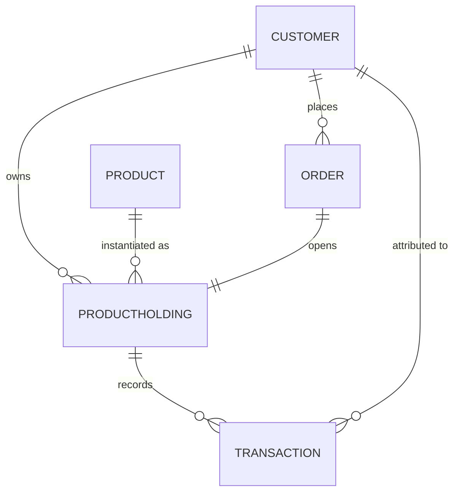

# Product & Customer Data Model

This document defines the data model exposed by the MCP servers in the agentic banking
ecosystem. Two MCP servers consume this model:

- **`customer_data_mcp_server`** — exposes `Customer`, `Account`, and `Transaction` entities.
- **`product_data_mcp_server`** — exposes the `Product` catalogue and per-customer `ProductHolding` records.

All data is fictional and stored as JSON/Markdown files that simulate a database. Every
MCP tool call is expected to be authenticated via Entra ID (see `narrative.md`).

---

## 1. Entities

### 1.1 Customer

Represents an individual banking customer of one bank (Bank North or Bank South).

| Field | Type | Description |
|-------|------|-------------|
| `customer_id` | string | Primary key, format `CUST-<4 digits>` (e.g. `CUST-1001`). |
| `bank` | enum | `Bank North` \| `Bank South`. |
| `full_name` | string | Legal name of the customer. |
| `date_of_birth` | date | ISO `YYYY-MM-DD`. |
| `email` | string | Contact email (fictional `.demo` domain). |
| `phone` | string | Contact phone number. |
| `address` | string | Residential address. |
| `nationality` | string | Country of nationality. |
| `tax_residency` | string | Country of tax residency. |
| `kyc_status` | enum | `verified` \| `pending` \| `review`. |
| `segment` | enum | `retail` \| `youth` \| `premium`. |
| `created_at` | date | Account relationship start date. |

### 1.2 Product (catalogue)

Represents a product definition from the catalogue. Product conditions are documented in
the knowledge base (`data/knowledge/*.md`).

| Field | Type | Description |
|-------|------|-------------|
| `product_code` | string | Primary key (e.g. `FLEXSAVE`, `GOLDCARD`). |
| `product_name` | string | Display name (e.g. `FlexSave`, `GoldCard`). |
| `category` | enum | `current_account` \| `savings` \| `childrens_savings` \| `securities` \| `credit_card`. |
| `currency` | string | ISO 4217 (default `EUR`). |
| `interest_rate` | number | Annual rate in percent (`null` if not applicable). |
| `annual_fee` | number | Annual fee in EUR (`0` if free). |
| `min_deposit` | number | Minimum deposit / balance in EUR. |
| `max_balance` | number\|null | Maximum balance in EUR (`null` = no limit). |
| `knowledge_ref` | string | Path to the knowledge file describing conditions. |

#### Catalogue values

| product_code | product_name | category | interest_rate | annual_fee | knowledge_ref |
|--------------|--------------|----------|---------------|------------|---------------|
| CURRENTPLUS | Current Account Plus | current_account | 0.00 | 0 | — |
| FLEXSAVE | FlexSave | savings | 0.75 | 0 | data/knowledge/savings-products.md |
| GROWTHSAVER | GrowthSaver | savings | 1.80 | 0 | data/knowledge/savings-products.md |
| FIXEDPLUS | FixedDeposit Plus | savings | 2.10 | 0 | data/knowledge/savings-products.md |
| KIDSSAVE | KidsSave | childrens_savings | 2.25 | 0 | data/knowledge/childrens-savings-products.md |
| TEENSAVER | TeenSaver | childrens_savings | 2.75 | 0 | data/knowledge/childrens-savings-products.md |
| FUTUREBUILDER | FutureBuilder | childrens_savings | 3.25 | 0 | data/knowledge/childrens-savings-products.md |
| SECURITIESDEPOT | Securities Depot | securities | null | 0 | data/knowledge/securities-products.md |
| WEALTHDEPOT | Wealth Depot | securities | null | 48 | data/knowledge/securities-products.md |
| CLASSICCARD | ClassicCard | credit_card | null | 29 | data/knowledge/credit-card-products.md |
| GOLDCARD | GoldCard | credit_card | null | 89 | data/knowledge/credit-card-products.md |
| PLATINUMCARD | PlatinumCard | credit_card | null | 199 | data/knowledge/credit-card-products.md |

### 1.3 ProductHolding (a.k.a. Account)

Represents an instance of a product held by a customer. Savings and current accounts have
an `iban`; credit cards have a `card_number`. A securities depot has neither — its
`balance` is the current **market value** of the portfolio and it carries no transaction
ledger in this demo. Transactions are attached to a holding.

| Field | Type | Description |
|-------|------|-------------|
| `account_id` | string | Primary key, format `ACC-<6 digits>`. |
| `customer_id` | string | Foreign key → `Customer.customer_id`. |
| `product_code` | string | Foreign key → `Product.product_code`. |
| `iban` | string\|null | IBAN for accounts (`null` for credit cards). |
| `card_number` | string\|null | Masked card number for credit cards (`null` for accounts). |
| `balance` | number | Current balance in EUR (negative = amount owed on a card). |
| `credit_limit` | number\|null | Credit limit for cards (`null` for accounts). |
| `currency` | string | ISO 4217 (default `EUR`). |
| `opened_at` | date | Date the holding was opened. |
| `status` | enum | `active` \| `blocked` \| `closed`. |

### 1.4 Transaction

Represents a single money movement on a `ProductHolding`.

| Field | Type | Description |
|-------|------|-------------|
| `transaction_id` | string | Primary key, format `TXN-<8 digits>`. |
| `account_id` | string | Foreign key → `ProductHolding.account_id`. |
| `customer_id` | string | Foreign key → `Customer.customer_id`. |
| `date` | date | ISO `YYYY-MM-DD`. |
| `direction` | enum | `debit` (money out) \| `credit` (money in). |
| `amount` | number | Positive amount in EUR. |
| `currency` | string | ISO 4217. |
| `category` | enum | `supplies` \| `online_shopping` \| `travel` \| `groceries` \| `dining` \| `utilities` \| `salary` \| `transfer` \| `fee` \| `interest`. |
| `merchant` | string | Counterparty / merchant name. |
| `description` | string | Free-text description. |
| `balance_after` | number | Holding balance after the transaction. |

---

### 1.5 Order (product application)

Represents a product application and its lifecycle — the "Vorgangs-Log" tracked
by the product data server. Created when a customer confirms `order_product`;
held in-memory for the life of the server process (not persisted in this demo).

| Field | Type | Description |
|-------|------|-------------|
| `order_id` | string | Primary key, format `ORD-<6 digits>`. |
| `customer_id` | string | Foreign key → `Customer.customer_id`. |
| `product_code` | string | Foreign key → `Product.product_code`. |
| `account_id` | string | Foreign key → the `ProductHolding` opened for the order. |
| `status` | enum | `requested` \| `approved` \| `rejected` \| `shipped` \| `delivered`. |
| `created_at` / `updated_at` | datetime | ISO-8601 timestamps. |
| `delivery` | object \| null | For cards: `{ estimated_business_days, shipping_address }`. |
| `history` | array | Append-only status changes `{ status, at, note }`. |

Lifecycle: `requested` → `approved` \| `rejected`; `approved` → `shipped` \|
`delivered`; `shipped` → `delivered`. Approving an order activates the linked
holding; rejecting it marks the holding `rejected`.

---

## 2. Relationships

- A `Customer` owns **1–3** `ProductHolding` records.
- Each `ProductHolding` references one `Product` from the catalogue.
- Each `ProductHolding` has **4–30** `Transaction` records.
- A `Customer` may place `Order` records; each opens one `ProductHolding`.

---

## 3. MCP Tool Surface

### 3.1 `customer_data_mcp_server`

| Tool | Input | Output | Access |
|------|-------|--------|--------|
| `list_customers` | `bank?` | `Customer[]` | read |
| `get_customer` | `customer_id` | `Customer` | read |
| `list_accounts` | `customer_id` | `ProductHolding[]` | read |
| `get_account` | `account_id` | `ProductHolding` | read |
| `list_transactions` | `account_id` \| `customer_id`, `from?`, `to?` | `Transaction[]` | read |
| `get_balance` | `account_id` | `{ balance, currency }` | read |
| `summarize_spending` | `customer_id`, `from?`, `to?`, `account_id?`, `category?`, `top_merchants?` | `{ total_spending, total_income, net, by_category[], top_merchants[], largest_transaction }` | read |
| `get_net_worth` | `customer_id` | `{ total_net_worth, by_category[], accounts[] }` | read |
| `update_customer` | `customer_id`, `fields` | `Customer` | write (HITL) |

### 3.2 `product_data_mcp_server`

| Tool | Input | Output | Access |
|------|-------|--------|--------|
| `list_products` | `category?` | `Product[]` | read |
| `get_product` | `product_code` | `Product` | read |
| `list_holdings` | `customer_id` | `ProductHolding[]` | read |
| `detect_opportunities` | `customer_id`, `liquidity_buffer?`, `min_idle_balance?`, `min_annual_gain?` | `{ opportunities[], count }` | read |
| `list_orders` | `customer_id?`, `status?` | `Order[]` | read |
| `get_order` | `order_id` | `Order` | read |
| `order_product` | `customer_id`, `product_code` | `{ order, holding }` | write (HITL) |
| `update_holding` | `account_id`, `fields` | `ProductHolding` | write (HITL) |
| `update_order_status` | `order_id`, `status`, `note?` | `Order` | write (HITL) |

> **Human-in-the-loop:** All `write` tools (ordering products, updating customers/holdings)
> require explicit human approval before the change is committed, per the flows in
> `narrative.md`.

---

## 4. Data Files

| File | Contents |
|------|----------|
| `data/products.md` | This data model + product catalogue. |
| `data/customers.md` | The 20 customers and their product holdings. |
| `data/transactions/<customer_id>_transactions.md` | Transactions for a single customer, one file per customer. |
| `data/knowledge/*.md` | Product conditions, compliance rules, and branch directories. |
