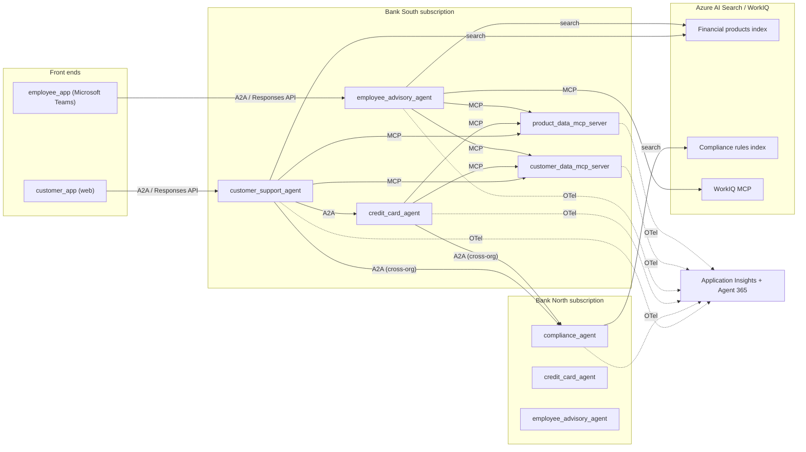

# Narrative

This story is about how an ecosystem of agents can collaborate across different departments, branches, and organisations inside a group of banks.
The key part is that each organisation can have its own data about customers, agents, and MCP servers.

## Objective

The objective is to provide technical implementation, architecture and code to demonstrate a complex scenario around agents that are collaborating across different organisations.

## Scope

The focus of this repo is about agents which are hosted and provided by different organisations - each organisation uses its own subscription to run its agents. The data for these agents will be hardcoded via JSON files that simulate the database via MCP servers - with supported tools for updating and reading data. All operations on APIs/MCP servers should be authenticated via Entra ID.
The amount of business operations should be limited to keep the original objective. This is not about a working business demo but a demo for agents collaborating across organisations. For this scope we will make the following assumptions:
- There are two banks, "Bank North" and "Bank South" - each bank runs its own agents, MCP servers, and data.
- Some agents are shared across banks (for example, the Compliance agent built by Bank North is consumed by Bank South).

## Scenario

The data for this engagement is about these data concerns:
- Banking customer data from a consumer side: What is my banking account balance? List my transactions from the last month?
- Banking products: List my financial products (credit card, savings account)? I want to order a credit card? Explain details about a product.
- Account data: What are my known personal details?
- Bank branch: where is the nearest one, when is it open, what kind of products can I buy from them?

### Agents

The agents should support A2A and responses api for external integration activated in Foundry hosted agents.

All agents should provide and name the sources that they used to generate responses by naming the source file and numbered hierarchy element.

Each agent is wired to a specific set of MCP servers, vector indexes, and grounding
documents. The bindings below define the linkage that must remain consistent across the
repository.

1. Consumer facing agent "Customer Support Agent" (customer_support_agent in code)
   - **Owner:** Bank South (consumer channel).
   - **MCP servers:** `customer_data_mcp_server` (balance, transactions, personal
     details), `product_data_mcp_server` (list/explain products).
   - **Vector indexes:** Financial products (product discovery), Compliance rules
     (guardrails via the Compliance agent).
   - **Grounding docs:** branch directory `data/knowledge/bank-south.md`; product
     conditions in `data/knowledge/savings-products.md`,
     `data/knowledge/credit-card-products.md`,
     `data/knowledge/childrens-savings-products.md`.
   - **Hand-offs (A2A):** `credit_card_agent` for card ordering, `compliance_agent`
     for regulatory/advice questions.

2. Employee facing agent "Employee Advisory agent" (employee_advisory_agent in code) for all employees that can access relevant product information
   - **Owner:** Bank North and Bank South (internal channel, one instance per bank).
   - **MCP servers:** `product_data_mcp_server` (full catalogue + conditions),
     `customer_data_mcp_server` (read-only customer context), WorkIQ (calendar and
     documents in the employee context).
   - **Vector indexes:** Financial products.
   - **Grounding docs:** all `data/knowledge/*-products.md`, plus the relevant branch
     directory (`data/knowledge/bank-north.md` / `data/knowledge/bank-south.md`).

3. Product-specific agent "Credit card agent" (credit_card_agent in code) that can guide a customer through the process of ordering a credit card.
   - **Owner:** each bank hosts its own instance.
   - **MCP servers:** `product_data_mcp_server` (`order_product`, `update_holding`),
     `customer_data_mcp_server` (eligibility context).
   - **Vector indexes:** Financial products (card comparison).
   - **Grounding docs:** `data/knowledge/credit-card-products.md` (card conditions,
     agent guidance, service flows) and `data/knowledge/compliance-regulatory.md`
     (credit card compliance section).
   - **Flows:** human-in-the-loop approval required before `order_product` commits.

4. Regulatory agent "Compliance agent" (compliance_agent in code) that is built by Bank North and provides guidance on regulatory questions. That agent is hosted as a service from Bank North to Bank South. It ensures regulatory compliance and escalates advice-related questions. The agent is grounded on compliance documentation.
   - **Owner:** Bank North; exposed as a cross-organisation A2A service to Bank South.
   - **MCP servers:** none required for reads; consumes the Compliance rules index only.
   - **Vector indexes:** Compliance rules.
   - **Grounding docs:** `data/knowledge/compliance-regulatory.md` (KYC, AML,
     sanctions, fraud, escalation matrix, audit requirements).

### MCP Servers

The MCP servers should be hosted in azure container apps. Every tool call is authenticated
via Entra ID. The canonical schema for all entities is defined in `data/products.md`.

1. Customer data mcp server (customer_data_mcp_server in code) that provide customer details about all customers of a specific bank, individual customer details with their attached accounts.
   - **Data sources:** `data/customers.json` (customers with nested product holdings)
     and `data/transactions.json` (customer → products → transactions). The per-customer
     markdown files under `data/transactions/` are the human-readable mirror of the same
     data.
   - **Entities served:** `Customer`, `ProductHolding`/`Account`, `Transaction`
     (see `data/products.md`).
   - **Tools:** `list_customers`, `get_customer`, `list_accounts`, `get_account`,
     `list_transactions`, `get_balance` (read); `update_customer` (write, HITL).

2. Product data mcp server (product_data_mcp_server in code) that provide customer details about customer products like credit card, bank account, saving account. The product data should contain conditions for monthly costs, interest rates on yearly basis
   - **Data sources:** the product catalogue in `data/products.md`, per-customer
     holdings in `data/customers.json`, and product conditions in
     `data/knowledge/savings-products.md`,
     `data/knowledge/credit-card-products.md`,
     `data/knowledge/childrens-savings-products.md`.
   - **Entities served:** `Product` (catalogue), `ProductHolding`.
   - **Tools:** `list_products`, `get_product`, `list_holdings` (read);
     `order_product`, `update_holding` (write, HITL).


### Vector Indexes

The vector indexes are built with Azure AI Search over the markdown knowledge base. The
indexer sources listed below define which files feed each index.

1. Financial products - with name, description, bank_id, tags, description_vector
The vector database should support vector searching for products based on the description vector
   - **Indexer sources:** `data/products.md` (catalogue rows) and the product knowledge
     docs `data/knowledge/savings-products.md`,
     `data/knowledge/credit-card-products.md`,
     `data/knowledge/childrens-savings-products.md`.
   - **Consumed by:** `customer_support_agent`, `employee_advisory_agent`,
     `credit_card_agent`.

2. Compliance rules - with all name, description, scenario, scenario_vector tags, description_vector
The vector database should support vector searching for scenario_vector and by description_vector
   - **Indexer source:** `data/knowledge/compliance-regulatory.md` (each rule / scenario
     becomes a document; regulatory domains map to `tags`).
   - **Consumed by:** `compliance_agent` (primary), and referenced by
     `customer_support_agent` and `credit_card_agent` for guardrails.

### Persona

1. Customer. The customer is directly linked to a specific bank and has accounts for different products. They want to use a web application to solve typical problems like "What accounts do I have? List all transactions in the last month? When is the bank reachable? Who is my contact for product X?"

2. Employee. The employee works in a bank and is either assigned to specific customers or products. They want to understand compliance rules for a specific product, get recommendations for new bank products while talking to a customer, or find the best internal contact for a specific product.

3. DevOps Team. They build and deploy the agents, web apps, and MCP servers. They want to automate every step of the dev and ops lifecycle. They want to see extensive metrics, logs, and traces on all business operations and all interactions between agents, MCP servers, and applications.

4. Agent Platform team. They approve and monitor agents inside the banks. They want to automate every process of the lifecycle and care about identity and permission assignments of the agents, and want to see all agents registered in Agent 365, publishing security telemetry and basic usage data.

### Datamodels

We need three data sets for customers with detailed products.
Products as described in data/knowledge for credit card products, savings products, and children's savings products.

The canonical data model — entities, fields, relationships, and the MCP tool surface — is
documented in `data/products.md`. The concrete data instances are:

| File | Role | Consumed by |
|------|------|-------------|
| `data/products.md` | Data model + product catalogue | product_data_mcp_server, Financial products index |
| `data/customers.json` | 20 customers with nested product holdings | customer_data_mcp_server, product_data_mcp_server |
| `data/customers.md` | Human-readable mirror of the customers | documentation |
| `data/transactions.json` | customer → products → transactions tree | customer_data_mcp_server |
| `data/transactions/CUST-*_transactions.md` | Per-customer transaction mirror | documentation |
| `data/knowledge/savings-products.md` | FlexSave, GrowthSaver, FixedDeposit Plus conditions | product_data_mcp_server, Financial products index |
| `data/knowledge/childrens-savings-products.md` | KidsSave, TeenSaver, FutureBuilder conditions | product_data_mcp_server, Financial products index |
| `data/knowledge/credit-card-products.md` | ClassicCard, GoldCard, PlatinumCard conditions | credit_card_agent, Financial products index |
| `data/knowledge/compliance-regulatory.md` | KYC/AML/sanctions/fraud rules | compliance_agent, Compliance rules index |
| `data/knowledge/bank-north.md` | Bank North branch directory + routing | customer_support_agent, employee_advisory_agent |
| `data/knowledge/bank-south.md` | Bank South branch directory + routing | customer_support_agent, employee_advisory_agent |

The structured demo data is regenerated deterministically by `scripts/generate_data.py`
(seeded), which emits `data/customers.md`, `data/customers.json`,
`data/transactions.json`, and the per-customer files under `data/transactions/`.


### Flows

The agent should support human-in-the-loop for all write operations, especially product ordering.


## Technology
- Agent 365 - foundation for agent identities, observability for all agent activities, inventory of agents
- Copilot, Copilot Studio, Scout - not directly in scope but as surface integration platforms for all banking agents
- Foundry Hosted agents - for custom container-hosted agents, especially autopilot agents in containers.
- Application Insights - for telemetry from agents and MCP servers by integrating the Application Insights and OpenTelemetry SDK in code.
- Azure Container Apps - for running custom MCP servers and data ingestion services via sandboxes
- WorkIQ - MCP server enabled through Agent 365 to enable access to calendar and documents in the user context
- Azure AI Search - for grounding unstructured knowledge about documents
- Python as implementation for the scripts and code. Microsoft Agent Framework and LangChain/LangGraph as SDK for orchestrating agents.
- The user interface should leverage MCP or A2A as the protocol to interact with the agents or MCP servers.

### Capabilities

The following relevant technical functionalities should be leveraged:
- All agents, MCP servers, and web applications should publish OTel-based telemetry into Application Insights using the respective frameworks.
- All MCP servers should be onboarded in the respective Foundry toolboxes - depending on the consumer.
- All agents should offer A2A and Responses API, which should be enabled through the built-in Foundry hosted agent support.

### Architecture

This is a multi-organisation agentic banking demo: two independent banks (Bank North,
Bank South), each in its own Azure subscription, running their own agents, MCP servers,
and data — collaborating across organisational boundaries via A2A.

#### Layers

- **Interaction layer** — two dedicated front ends, plus Copilot / Copilot Studio / Scout
  as additional surface integrations:
  - `customer_app` — a **web application** for banking customers. Talks to
    `customer_support_agent` over **A2A / Responses API**.
  - `employee_app` — an internal application for bank employees, surfaced inside
    **Microsoft Teams** (Teams app / message extension). Talks to
    `employee_advisory_agent` over **A2A / Responses API**.
  - Both apps reach agents over A2A / Responses API; they do **not** call MCP servers
    directly — all data access is mediated by the agents.
- **Agent layer** (Foundry hosted agents, container-based on Azure Container Apps) — each
  agent exposes **A2A + Responses API**. MCP server dependencies per agent:
  - `customer_support_agent` (Bank South, consumer) — **depends on**
    `customer_data_mcp_server` (balance, transactions, personal details) and
    `product_data_mcp_server` (list/explain products); hands off to `credit_card_agent`
    and `compliance_agent`.
  - `employee_advisory_agent` (one instance per bank, internal) — **depends on**
    `product_data_mcp_server` (full catalogue), `customer_data_mcp_server` (read-only
    customer context), and **WorkIQ MCP** (calendar and documents in the user context).
  - `credit_card_agent` (one instance per bank) — **depends on** `product_data_mcp_server`
    (`order_product`, `update_holding`) and `customer_data_mcp_server` (eligibility
    context); HITL approval before `order_product`.
  - `compliance_agent` (Bank North, exposed cross-org as a service to Bank South) — **no
    MCP dependency**; consumes the Compliance rules index only.
  - Domain flows are loaded from a `/skills` subfolder per agent.
- **Tool layer** (MCP servers on Azure Container Apps, every tool call authenticated via
  Entra ID):
  - `customer_data_mcp_server` → `customers.json` + `transactions.json`.
  - `product_data_mcp_server` → `products.md` + `customers.json` + product knowledge docs.
  - All write tools are human-in-the-loop.
- **Knowledge / retrieval layer** — Azure AI Search vector indexes: *Financial products*
  (product docs) and *Compliance rules* (`compliance-regulatory.md`).
- **Platform / cross-cutting** — Agent 365 for agent identity, inventory, and security
  telemetry; Application Insights + OpenTelemetry for traces across all agents, servers,
  and apps; user-assigned managed identities with permissions assigned at
  resource-creation time.

#### Communication paths

Every hop is authenticated with Entra ID and travels over the public internet (no private
networking). The protocol on each edge is explicit:

| # | Path | Protocol | Direction / notes |
|---|------|----------|-------------------|
| 1 | `customer_app` (web) → `customer_support_agent` | A2A / Responses API | Customer front end |
| 2 | `employee_app` (Microsoft Teams) → `employee_advisory_agent` | A2A / Responses API | Employee front end |
| 3 | `customer_support_agent` → `credit_card_agent` | A2A | Intra-bank hand-off (card ordering) |
| 4 | `customer_support_agent` → `compliance_agent` | A2A | **Cross-org** (Bank South → Bank North) |
| 5 | `credit_card_agent` → `compliance_agent` | A2A | **Cross-org** guardrail check |
| 6 | `customer_support_agent` → `customer_data_mcp_server` + `product_data_mcp_server` | MCP | Tool dependency (read + HITL writes) |
| 7 | `employee_advisory_agent` → `product_data_mcp_server` + `customer_data_mcp_server` | MCP | Tool dependency (read) |
| 8 | `credit_card_agent` → `product_data_mcp_server` + `customer_data_mcp_server` | MCP | Tool dependency (`order_product`, eligibility) |
| 9 | Agent → Azure AI Search | Search query (HTTPS) | Vector / grounding retrieval |
| 10 | `employee_advisory_agent` → WorkIQ MCP | MCP | Calendar + documents in user context |
| 11 | All components → Application Insights | OTLP (OpenTelemetry) | Telemetry / traces |
| 12 | All components ↔ Agent 365 | Identity + telemetry | Registration, security signals |

Data access is always **mediated by an agent**: the two web apps never call an MCP server
directly. The two **cross-organisation** edges (4 and 5) are the core of the story: Bank
South's agents consume Bank North's `compliance_agent` as an A2A service across
subscription and tenant boundaries.




### Implementation

Important rules for implementation:
- Always use the latest version of the relevant Python packages - also use an available beta version if it is available and compatible.
- All components (web apps, agents, MCP servers) should be self-contained with few cross-dependencies.
- All relevant deployment artifacts should be in the folder of the component (JSON files, config, markup) so that the Dockerfile can be easily deployed.
- Use user-assigned managed identity where possible and assign permissions as early as possible, ideally during resource creation.
- Communication between agent and servers can go over the public internet and must not go through a private network.
- The domain-specific flow and business process of an agent should be loaded from a skill. The respective agent should put the skills into a subfolder /skills of the agent.


Naming conventions:
<domain>_agent
<domain>_app
<domain>_mcp
<domain>_workflow

## Repository

The structure of the repo should be like this
/src 
  /agents
  /tools  # mcp servers
  /apps # web apps
  /workflows # foundry declarative workflows

/infra # infra as code
/data # payload data
/docs # documentation
/tests # test data

## Setup

### infra deployment

### code and agent deployment

### data generation

The fictional structured data is generated by a single seeded script:

```
python3 scripts/generate_data.py
```

This (re)creates `data/customers.md`, `data/customers.json`, `data/transactions.json`,
and the per-customer files in `data/transactions/`. The knowledge markdown under
`data/knowledge/` and the data model in `data/products.md` are authored by hand.

### Components

The repository is organised so that each runtime component references its data through
stable relative paths:

```
data/
  products.md                     # canonical data model + product catalogue
  customers.json / customers.md   # customers with nested product holdings
  transactions.json               # customer -> products -> transactions tree
  transactions/                   # per-customer transaction mirror (markdown)
  knowledge/
    savings-products.md           # -> product_data_mcp_server, Financial products index
    childrens-savings-products.md # -> product_data_mcp_server, Financial products index
    credit-card-products.md       # -> credit_card_agent, Financial products index
    compliance-regulatory.md      # -> compliance_agent, Compliance rules index
    bank-north.md                 # -> Bank North agents (branch directory + routing)
    bank-south.md                 # -> Bank South agents (branch directory + routing)
scripts/
  generate_data.py                # seeded generator for the structured data
```

**Linkage summary**

- **Agents → MCP servers:** `customer_support_agent` and `employee_advisory_agent` use
  both `customer_data_mcp_server` and `product_data_mcp_server`; `credit_card_agent` uses
  `product_data_mcp_server` (+ read access to `customer_data_mcp_server`);
  `compliance_agent` uses no MCP server (index-only).
- **MCP servers → data:** `customer_data_mcp_server` → `customers.json` +
  `transactions.json`; `product_data_mcp_server` → `products.md` + `customers.json` +
  product knowledge docs.
- **Indexes → knowledge:** Financial products index → `products.md` + the three
  `*-products.md` docs; Compliance rules index → `compliance-regulatory.md`.
- **Agents → indexes/grounding:** as defined per agent in the Agents section above.

